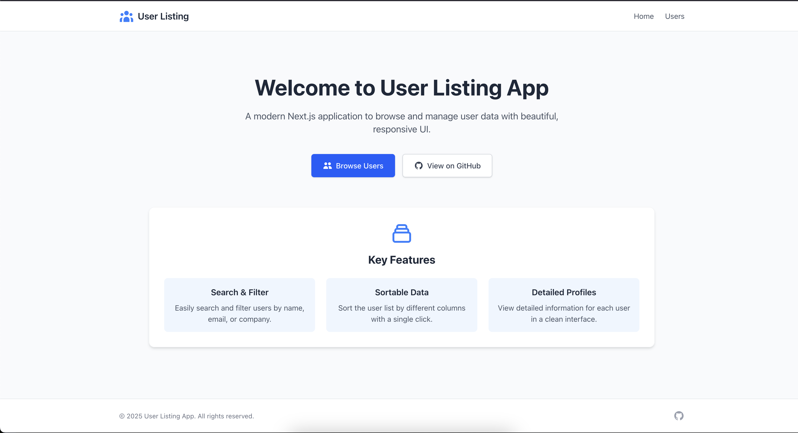

# User Listing Application

A Next.js application to browse and manage user data fetched from an external API.

## Live Demo

Visit the live application: [https://my-user-2yy03hcj5-hecdevelopers-projects.vercel.app](https://my-user-2yy03hcj5-hecdevelopers-projects.vercel.app)

## 🖼️ Preview

To add a screenshot of your app:
1. Take a screenshot of your application
2. Save it as `screenshot.png` in the `public` folder
3. Uncomment the line below:

<!--  -->

## Features

- View a list of all users with sortable columns
- Search users by name, email, or company
- View detailed user information on dedicated pages
- Responsive design with Tailwind CSS
- Server-side rendering for the user list page
- Static generation with incremental static regeneration for user detail pages

## Tech Stack

- [Next.js](https://nextjs.org/) - React framework
- [TypeScript](https://www.typescriptlang.org/) - Type safety
- [Tailwind CSS](https://tailwindcss.com/) - Utility-first CSS framework
- [JSON Placeholder API](https://jsonplaceholder.typicode.com/) - RESTful API for demo data

## Getting Started

### Prerequisites

- Node.js 16.8.0 or later
- npm or yarn

### Installation

1. Clone the repository:

```bash
git clone https://github.com/hecdeveloper/my-user-app.git
cd my-user-app
```

2. Install dependencies:

```bash
npm install
# or
yarn install
```

3. Run the development server:

```bash
npm run dev
# or
yarn dev
```

4. Open [http://localhost:3000](http://localhost:3000) in your browser.

## Project Structure

```
my-user-app/
├── src/
│   ├── components/        # Reusable React components
│   │   ├── UserCard.tsx   # Component for detailed user view
│   │   └── UserTable.tsx  # Table component with sorting
│   ├── pages/             # Next.js pages
│   │   ├── index.tsx      # Home page
│   │   ├── _app.tsx       # App wrapper component
│   │   └── users/         # User pages
│   │       ├── index.tsx  # User listing page
│   │       └── [id].tsx   # User detail page
│   ├── styles/            # Global styles
│   └── types/             # TypeScript type definitions
├── public/                # Static files
├── README.md              # Project documentation
└── package.json           # Dependencies and scripts
```

## Deployment

The application is deployed on Vercel:

[](https://my-user-2yy03hcj5-hecdevelopers-projects.vercel.app)

## License

This project is licensed under the MIT License - see the LICENSE file for details.
